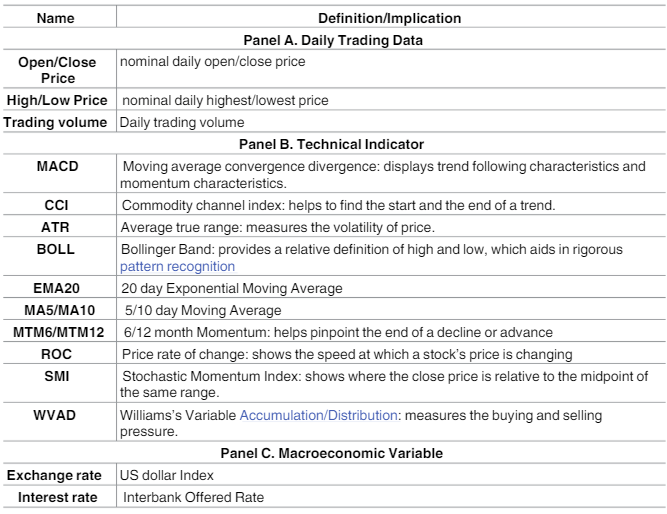

## INVESTIGATE THE APPLICATION OF ATTENTION IN STOCK INDEX TIMESERIES PREDICTION

### Project Information
University: Northwester University

Professor: Prof. Bryan Pardo

Project Members & Contact Information:
  Yao Gu
  Zijian Zhao
  Yuxiang(Alvin) Chen  Email: yuxiangchen2021@u.northwestern.edu

Github Repository:
  Here is our [GitHub Repository](https://github.com/yaogood/stock-price-prediction)

### Motivation:

Stock index value prediction is a highly challenging study for both research and industry. Applying Deep Learning techniques to financial time series datasets has been a popular methodology. Existing prediction models are mostly based on complex Multi-Layer Perceptrons, Recurrent or Convolutional Neural Networks. However, Attention is a very useful mechanism as the length of the input data increases. It has been widely used in NLP tasks but underutilized in stock time-series prediction models. Thus, we built three deep learning models with different extent of application of attention to mine the same financial time series datasets and predict stock index price moves and evaluate their performances to examine how applicaiton of attention affect model perfromance.

The three models we chose are: 
  1. LSTM Encoder-Decoder Network; 
  2. LSTM Encoder-Decoder Network with Attention; 
  3. Transformer; 
  
This research problem is an important one because we can verify what extent of attention mechanism is the most appropriate for financial time series prediction and effective model construction. No research has been conducted with a focus on comparing these three models with different attention applications. The conclusion will be meaningful for future new model development. This is also a rewarding problem to solve because mining huge amounts of financial datasets can bring a lot of benefits for investing judgements. 

### Methodology & Expriment
•Describe what you’re doing in very high level terms •Describe how you built/ tested (what your dataset was, how you measured success)

### Model Tasks

All 3 models are constructed to tackle the same task.

They take 30 days of input varaible data and predict the close price daily percentage move of the next day. If this task could be well conducted, trading strategy with daily adjustment could be constructed from it.

We keep the task same to compare the performance of three model studctures.

### Data Used

This graph shows the candidate variables we explored for our model

### Model Details

### Results
•Describe some results (how well it worksin no more than a paragraph)

Result Table

|    | MAPE | R | Theil U |
| -- | ---  | - | ------- |
| LSTM Encoder Decoder             |   | |
| LSTM Encoder Decoder + Attention |  | |
| Transformer                      |     | |

